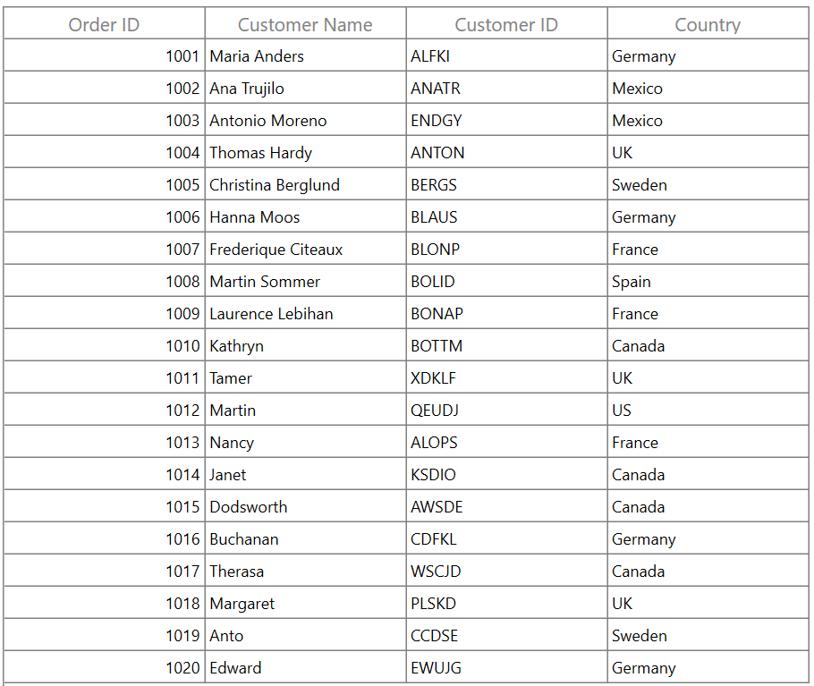
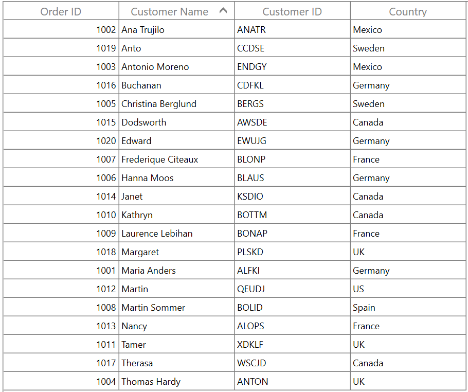
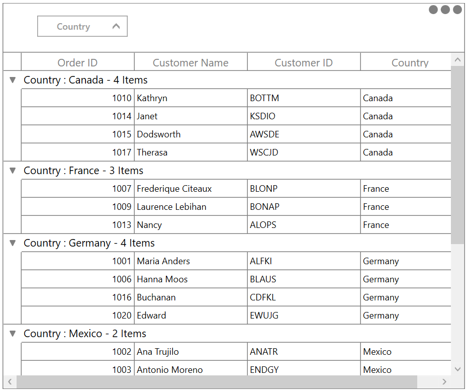
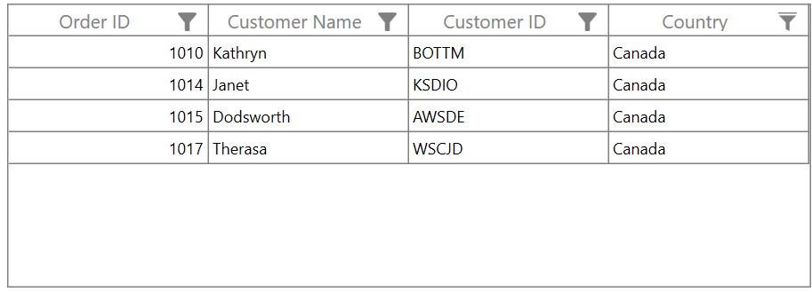

# How to Bind the DataTable to WPF DataGrid?

This sample show cases how to bind the data table to [WPF DataGrid](https://www.syncfusion.com/wpf-ui-controls/datagrid) (SfDataGrid).

`DataGrid` supports to bind the [DataTable](https://learn.microsoft.com/en-us/dotnet/api/system.data.datatable?view=net-5.0) as `ItemsSource`. You can also bind the datatable from the [DataSet](https://learn.microsoft.com/en-us/dotnet/api/system.data.dataset?view=netframework-4.8).

### ViewModel creation

Create a view model class in the WPF project similar to the one in the following code example.

``` csharp
public class ViewModel
{
    public ViewModel()
    {
        DataTableCollection = GetDataTable();
    }

    public DataTable DataTableCollection { get; set; }
 
    private DataTable GetDataTable()
    {
        DataTable dataTable = new DataTable();
        dataTable.Columns.Add("Order ID", typeof(int));
        dataTable.Columns.Add("Customer Name", typeof(string));
        dataTable.Columns.Add("Customer ID", typeof(string));
        dataTable.Columns.Add("Country", typeof(string));
        dataTable.Rows.Add(1001, "Maria Anders", "ALFKI", "Germany");
        dataTable.Rows.Add(1002, "Ana Trujilo", "ANATR", "Mexico");
        dataTable.Rows.Add(1003, "Antonio Moreno", "ENDGY", "Mexico");
        dataTable.Rows.Add(1004, "Thomas Hardy", "ANTON", "UK");
        dataTable.Rows.Add(1005, "Christina Berglund", "BERGS", "Sweden");
        dataTable.Rows.Add(1006, "Hanna Moos", "BLAUS", "Germany");
        dataTable.Rows.Add(1007, "Frederique Citeaux", "BLONP", "France");
        dataTable.Rows.Add(1008, "Martin Sommer", "BOLID", "Spain");
        dataTable.Rows.Add(1009, "Laurence Lebihan", "BONAP", "France");
        dataTable.Rows.Add(1010, "Kathryn", "BOTTM", "Canada");
        dataTable.Rows.Add(1011, "Tamer", "XDKLF", "UK");
        dataTable.Rows.Add(1012, "Martin", "QEUDJ", "US");
        dataTable.Rows.Add(1013, "Nancy", "ALOPS", "France");
        dataTable.Rows.Add(1014, "Janet", "KSDIO", "Canada");
        dataTable.Rows.Add(1015, "Dodsworth", "AWSDE", "Canada");
        dataTable.Rows.Add(1016, "Buchanan", "CDFKL", "Germany");
        dataTable.Rows.Add(1017, "Therasa", "WSCJD", "Canada");
        dataTable.Rows.Add(1018, "Margaret", "PLSKD", "UK");
        dataTable.Rows.Add(1019, "Anto", "CCDSE", "Sweden");
        dataTable.Rows.Add(1020, "Edward", "EWUJG", "Germany");
        return dataTable;
    }
}
```

### Binding ItemsSource in XAML

In the main page, add the necessary XML namespace to use `DataGrid` control, set the DataContext of the window to the `ViewModel` class, and bind the `ItemsSource` of `DataGrid` with the `DataTableCollection`.

``` xml
<Window x:Class="SfDataGridDemo.MainWindow"
        xmlns="http://schemas.microsoft.com/winfx/2006/xaml/presentation"
        xmlns:x="http://schemas.microsoft.com/winfx/2006/xaml"
        xmlns:d="http://schemas.microsoft.com/expression/blend/2008"
        xmlns:mc="http://schemas.openxmlformats.org/markup-compatibility/2006"
        xmlns:local="clr-namespace:SfDataGridDemo"
         xmlns:syncfusion="http://schemas.syncfusion.com/wpf"
        mc:Ignorable="d"
        Title="MainWindow" Height="450" Width="800">
    <Window.DataContext>
        <local:ViewModel/>
    </Window.DataContext>
    <Grid>
        <syncfusion:SfDataGrid x:Name="dataGrid"  ItemsSource="{Binding DataTableCollection}" />
    </Grid>
</Window>
```




### CRUD operations

DataGrid automatically refreshes the UI whenever we add, delete or modify the rows of the underlying DataTable collection.

### Data operations

DataGrid supports various data operations to represent the data in it. The following are supported by default:

* Sorting (including multicolumn sorting)
* Grouping (including multicolumn grouping)
* Filtering
* Summaries

#### Sorting

You can sort columns with the various built-in options such as [multicolumn sorting](https://help.syncfusion.com/wpf/datagrid/sorting#multi-column-sorting) and [tri-state sorting](https://help.syncfusion.com/wpf/datagrid/sorting#sorting-order). But [custom sorting](https://help.syncfusion.com/wpf/datagrid/sorting#custom-sorting) is not supported.

In the following screenshot, the datagrid is sorted in ascending order with respect to the **Customer Name** column.



#### Grouping

The data can be organized in a hierarchical structure based on matching field values. [Custom grouping](https://help.syncfusion.com/wpf/datagrid/grouping#custom-grouping) are also supported.



#### Filtering

You can filter columns with the various built-in options such as [Excel like UI filtering](https://help.syncfusion.com/wpf/datagrid/filtering#excel-like-ui-filtering), [Advanced UI filtering](https://help.syncfusion.com/wpf/datagrid/filtering#advanced-filter-ui) and [Programmatic filtering](https://help.syncfusion.com/wpf/datagrid/filtering#column-filtering) by using [FilterPredicates](https://help.syncfusion.com/cr/cref_files/wpf/Syncfusion.SfGrid.WPF~Syncfusion.UI.Xaml.Grid.GridColumn~FilterPredicates.html). But DataGrid’s built-in [View.Filter](https://help.syncfusion.com/cr/wpf/Syncfusion.Data.CollectionViewAdv.html#Syncfusion_Data_CollectionViewAdv_Filter) is not supported for the DataTable class. But you can filter the records using DataTable's [DataView.RowFilter](https://docs.microsoft.com/en-us/dotnet/api/system.data.dataview.rowfilter?view=netframework-4.8) property.



#### Summaries

All summary types supported by DataGrid are supported for DataTable, i.e. [group summary](https://help.syncfusion.com/wpf/datagrid/summaries#group-summary), [caption summary](https://help.syncfusion.com/wpf/datagrid/summaries#caption-summaries), and [table summary](https://help.syncfusion.com/wpf/datagrid/summaries#table-summary).

### Other features

The support for all other features, such as stacked headers, row drag and drop, unbound column, and unbound row, of DataGrid are available.

Take a moment to peruse the [WPF DataGrid - Overview](https://help.syncfusion.com/wpf/datagrid/overview) documentation, to learn more about the DataGrid's feature sets.